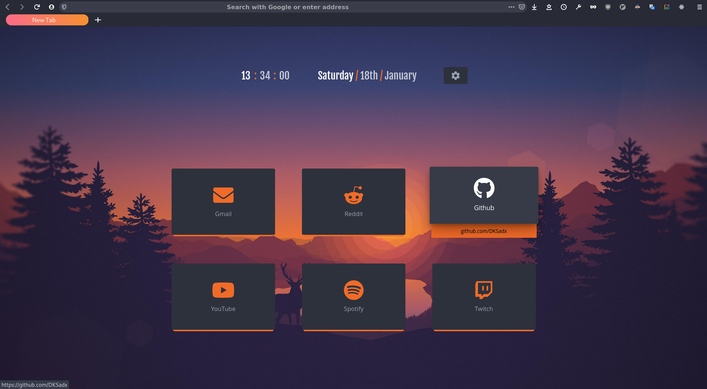

Custom version of <a href="https://github.com/turing753/minimal-functional-fox">minimal-functional-fox</a>

_userChrome.js/userChrome.xml was removed because firefox 72+ dropped support for it, you can still find it in previous commits_

New/home tab addon: <a href="https://github.com/zombieFox/nightTab">nightTab</a>

Wallpaper <a href="https://wallpaperaccess.com/download/minimalist-nature-1261639"> here </a>

**Note: This layout was tested only on 1920x1080 resolution, if some components look different you will have to modify the values in the `userChrome.css` file**

## Instructions

- Make sure that you have enabled the **userChrome** option

  1. Go to the address `about:config` in Firefox
  2. Search for `toolkit.legacyUserProfileCustomizations.stylesheets`
  3. Confirm the option is set to true

- Make sure that you have the `Dark` theme enabled

  1. Go to the address `about:addons`
  2. Select `Themes`
  3. Enable the `Dark` theme if not already enabled

- Copy the contents of this repository to `~/.mozilla/firefox/<your-profile-name>/chrome/`
  - If there isn't a chrome folder, you can just go ahead and create one
